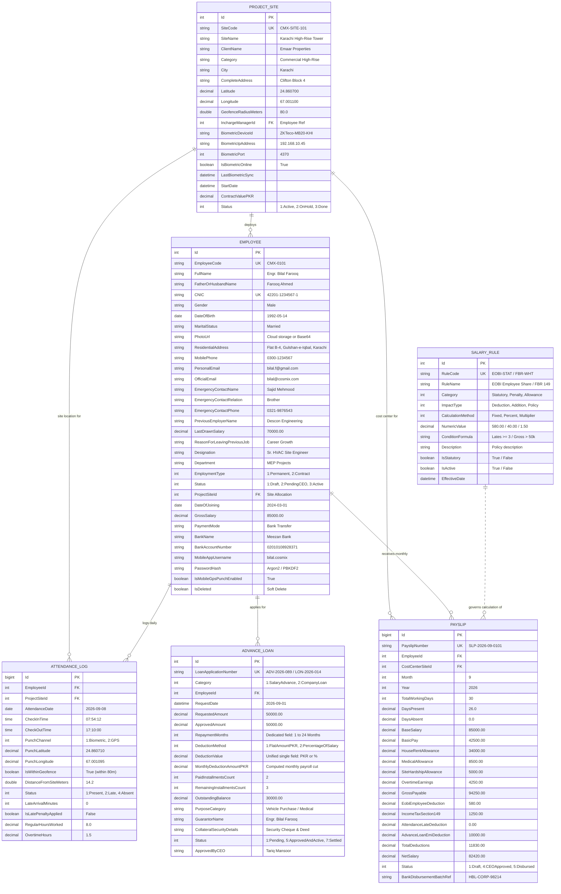

# Cosmix Engineering ERP - HR & Site Operations ERD

This document specifies the complete Entity Relationship Diagram (ERD), data dictionary, primary & foreign keys, indexing strategy, and database constraints for Cosmix Engineering (.NET 10 & React architecture).

---

## 1. Entity Relationship Diagram (Mermaid)

---

## 2. Table Dictionaries & Schema Specifications

### `hr.Employees`
- **Primary Key**: `Id` (INT, IDENTITY)
- **Unique Keys**: `EmployeeCode` (`CMX-XXXX`), `CNIC` (`XXXXX-XXXXXXX-X`)
- **Key Relationships**:
  - `ProjectSiteId` $\rightarrow$ `hr.ProjectSites(Id)` (Restrict Delete)
- **Key Fields Added**:
  - `PhotoUrl`: Stored cloud URI or CDN URL for the uploaded passport photo.
  - `ResidentialAddress`: Detailed home address for site correspondence and police verification.
  - `EmergencyContactName`, `EmergencyContactRelation`, `EmergencyContactPhone`: Dedicated emergency contact record.
  - `PreviousEmployerName`, `LastDrawnSalary`, `ReasonForLeavingPreviousJob`: Background verification & negotiation reference.

### `hr.ProjectSites`
- **Primary Key**: `Id` (INT, IDENTITY)
- **Unique Key**: `SiteCode` (`CMX-SITE-XXX`)
- **Key Fields**:
  - `Latitude`, `Longitude`: Geodetic coordinates (decimal 9,6).
  - `GeofenceRadiusMeters`: Maximum allowed distance from coordinates for mobile check-ins (default: 80m).
  - `BiometricDeviceId`, `BiometricIpAddress`, `BiometricPort`: Hardware sync configuration for local ZKTeco devices.

### `hr.SalaryRules`
- **Primary Key**: `Id` (INT, IDENTITY)
- **Unique Key**: `RuleCode` (`EOBI-STAT`, `FBR-WHT`, `ATT-LATE-15`, `HRA-40`, etc.)
- **Category Matrix**:
  - Statutory: EOBI (PKR 580 flat employee contribution), FBR Sec 149 Withholding.
  - Attendance Penalties: 15-minute grace rule, 3 late arrivals = 0.5 day wage deduction, unexcused absence = 1.0 day cut.
  - Allowances: HRA 40%, Medical 10%, Remote Site Hardship PKR, Overtime multipliers (1.5x / 2.0x).
  - Loans: Maximum advance salary cap (50% of gross), maximum recovery installments (3 to 6 months).

### `hr.AttendanceLogs`
- **Primary Key**: `Id` (BIGINT, IDENTITY)
- **Unique Constraint**: `(EmployeeId, AttendanceDate)`
- **Foreign Keys**:
  - `EmployeeId` $\rightarrow$ `hr.Employees(Id)`
  - `ProjectSiteId` $\rightarrow$ `hr.ProjectSites(Id)`
- **Geofence Calculation**:
  Distance calculated via Haversine formula on mobile check-in:
  $$d = 2r \arcsin\left(\sqrt{\sin^2\left(\frac{\Delta \phi}{2}\right) + \cos(\phi_1)\cos(\phi_2)\sin^2\left(\frac{\Delta \lambda}{2}\right)}\right)$$
  If $d \le \text{GeofenceRadiusMeters}$, `IsWithinGeofence = True`, otherwise flagged as exception for HR review.

### `hr.Payslips`
- **Primary Key**: `Id` (BIGINT, IDENTITY)
- **Unique Constraint**: `(EmployeeId, Month, Year)`
- **Cost Center Tracking**: `CostCenterSiteId` allocates worker salary directly to the client project P&L.
