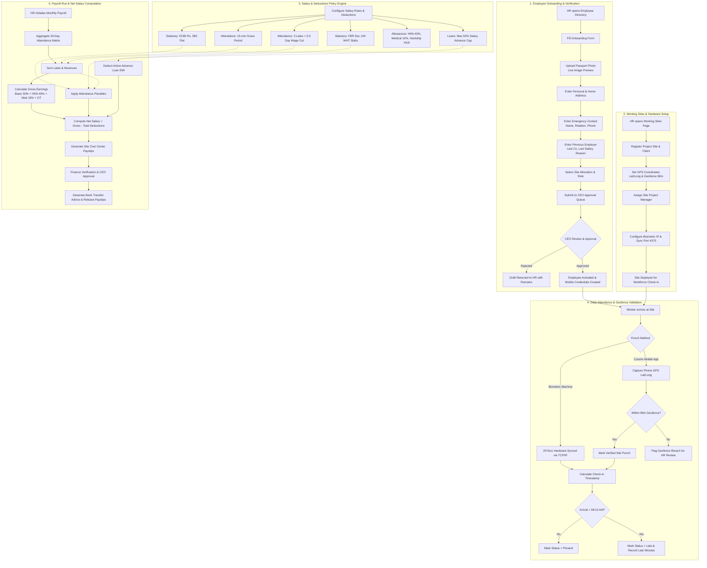

# Cosmix Engineering ERP - HR & Site Operations Business Process Flowchart

This document details the end-to-end business workflows covering Employee Onboarding with Photo/Address/Emergency/Experience verification, Working Sites & Geofencing Management, Biometric Attendance with 15-min Grace & Late Penalty Rules, and Monthly Payroll Generation.

---

## 1. Complete Workflow Diagram (Mermaid)

---

## 2. Business Flow Highlights

1. **Strict Multi-Tier Verification**:
   - HR enters full credentials including residential address, emergency contact details, and prior employer salary benchmarks.
   - Profile stays in `Draft / PendingCEO` until CEO signs off on the compensation package.

2. **Site Operations & Automated Geofencing**:
   - Project sites maintain geodetic coordinates with an 80m perimeter.
   - Workers using the Cosmix Android/iOS app are checked against the site radius before a punch is accepted as valid.
   - Site biometrics automatically sync hourly to ensure field attendance integrity.

3. **Rulebook Driven Payroll**:
   - Instead of hardcoding deductions in payroll, calculations pull dynamically from the `SalaryRules` repository.
   - EOBI contribution (Rs. 580) and FBR tax withholding are automatically computed.
   - 3 cumulative late arrivals (after the 15-min grace threshold) trigger a half-day wage deduction automatically during payroll computation.
